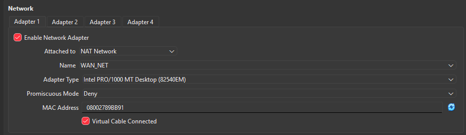
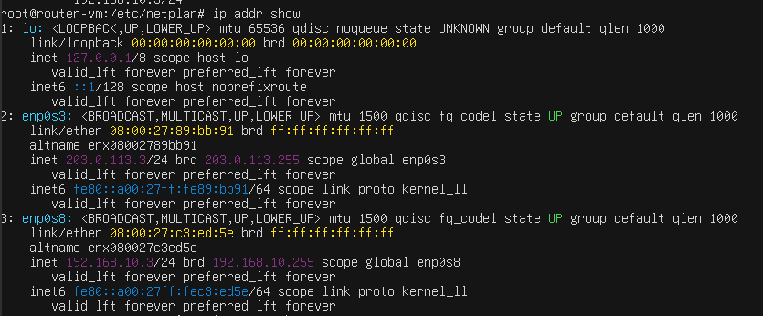
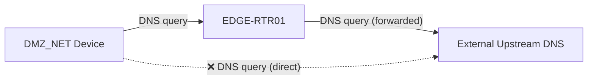
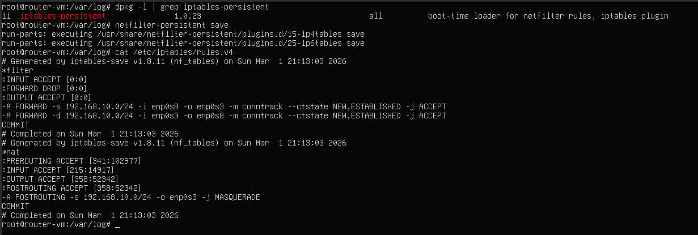

---
tags:
  - ubuntu-server
  - edge-router
  - nat
  - dns
  - iptables
  - lab-infrastructure
os: Ubuntu Server (Latest LTS)
role: Edge Router / NAT Gateway / DNS Forwarder
network:
  - WAN_NET: 203.0.113.3/24
  - DMZ_NET: 192.168.10.3/24
---

# EDGE-RTR01 (Edge Router)

EDGE-RTR01 serves as the boundary device between the **WAN_NET** and the **DMZ_NET**. Since devices in the DMZ use private, non-routable IP addresses, this router performs Network Address Translation (NAT) for packets exiting the WAN interface, ensuring external connectivity for DMZ assets.

---

## VM Hardware Configuration

EDGE-RTR01 is designed as a lightweight router running Ubuntu Server. Its minimal resource footprint allows it to perform routing and DNS functions without significant overhead.

### Specifications
| Feature | Configuration |
| :--- | :--- |
| **OS** | Ubuntu Server (Latest LTS) |
| **RAM** | 512MB |
| **CPU** | 1 Core |
| **Storage** | 10GB |
| **NIC 1** | `WAN_NET` (NAT Network) |
| **NIC 2** | `DMZ_NET` (Internal Network) |


> [!IMPORTANT]
> To facilitate system updates during initial setup, the network adapters are initially set to **NAT** mode. Once updates are complete, they are reconfigured to their respective lab segments as described in the [OS Configuration](#os-installation--configuration) section.




### Network Segmentation Approach
This lab utilizes dual NICs for physical segmentation, which is simple and effective for small-scale environments. In larger enterprise deployments, **VLANs (802.1Q)** are typically preferred for scalability and cost-efficiency. However, due to VirtualBox's native limitations with VLAN tagging compared to other hypervisors, the multi-NIC approach was chosen for reliability.

---

## OS Installation & Configuration

### 1. Installation & Initial Updates
During the Ubuntu Server installation, use the following credentials:

| Field | Value |
| :--- | :--- |
| **Username** | `router-vm` |
| **Password** | `P@ssw0rd123` |

After the first boot, ensure the VM has internet access (via temporary NAT settings) and run:

```bash
sudo apt update && sudo apt upgrade -y
```

Additionally, install `vim` (or just use `nano`):

```bash
sudo apt install vim -y
```

Once updated, power off the VM and revert the VirtualBox NIC settings to their permanent lab segments (**WAN_NET** and **DMZ_NET**).

### 2. Network Configuration (Netplan)
Identify the interface names assigned by the OS:

```bash
ip addr show
```



> [!NOTE]
> The screenshot above shows the interfaces *after* configuration. Use MAC addresses in VirtualBox settings to verify which interface (e.g., `enp0s3`) maps to which network segment.

#### Creating the Netplan Configuration
Disable the default installer configuration and create a new lab-specific plan:

```bash
sudo su -
cd /etc/netplan
mv 00-installer-config.yaml 00-installer-config.yaml.bak
touch 01-EDGE-RTR01-config.yaml
chmod 600 01-EDGE-RTR01-config.yaml
```

> [!NOTE]
> It is important that the permissions for the netplan yaml file are restrictive e.g set to 600 as root ( read and write for owner only! ) . Otherwise, netplan will outright refuse to use the configuration as the permissions are too open!
> 
> Why is this required?
>
> 1. **Security:** Netplan files contain sensitive information such as Wi-Fi passwords (Pre-Shared Keys), tunnel secrets, or internal network topology details.
> 2. **Best Practice:** Since these files define the core networking of the system, only the root user should be able to read and modify them.


Edit `01-EDGE-RTR01-config.yaml` with the following settings:


> [!NOTE]
> A very common gotcha in configuring yaml files is the use of `tab` character. Only use `space`! 
> The standard is 2 space per indentation level.


**Configuration Summary:**

| Interface | Segment | IP Address        | Gateway       | DNS Servers          |
| :-------- | :------ | :---------------- | :------------ | :------------------- |
| `enp0s3`  | WAN_NET | `203.0.113.3/24`  | `203.0.113.1` | `8.8.8.8`, `1.1.1.1` |
| `enp0s8`  | DMZ_NET | `192.168.10.3/24` | None          | None                 |

Apply the changes:

```bash
netplan apply
```

---

## DNS Services (dnsmasq)

To increase visibility into network activity, DMZ devices forward DNS queries to EDGE-RTR01 rather than resolving them externally.



### 1. Installation
Install `dnsmasq` to provide DNS forwarding and caching services:

```bash
sudo apt install dnsmasq -y
```

### 2. Resolving Port 53 Conflicts
By default, `systemd-resolved` listens on port 53, conflicting with `dnsmasq`.

> [!NOTE]
> **What is a DNS Stub Listener?**
> A lightweight service that sits between local applications and upstream servers, caching queries to improve performance.

Identify the conflict:

```bash
# ss socket statistics
# -t Show TCP sockets
# -u Show UDP sockets
# -l Show only listening sockets
# -p Show the process using the socket

ss -tulp | grep 53
```


#### Fix: Disable the Stub Listener
Edit `/etc/systemd/resolved.conf`:

```ini
[Resolve]
DNSStubListener=no
```

Update the `/etc/resolv.conf` symlink to point to the real upstream configuration instead of the local stub:

```bash
sudo ln -sf /run/systemd/resolve/resolv.conf /etc/resolv.conf
```

Restart the service and verify port 53 is free:

```bash
sudo systemctl restart systemd-resolved
ss -tulp | grep 53
ping -c 4 google.com
```

### 3. Configuring dnsmasq
Create a clean configuration file:

```bash
sudo mv /etc/dnsmasq.conf /etc/dnsmasq.conf.bak
sudo vim /etc/dnsmasq.conf
```

Add the following directives:

```text
# Security & Performance
domain-needed 
bogus-priv
no-resolv

# Upstream Servers
server=8.8.8.8
server=1.1.1.1

# Listening Interface (DMZ only)
interface=enp0s8 

# Logging for SIEM/Visibility
log-queries
log-facility=/var/log/dnsmasq.log
```

> [!NOTE]
> 1. **domain-needed** — Never forward plain hostnames (without a dot) to upstream DNS. Prevents leakage of internal hostnames to the outside world.
>
> 2. **bogus-priv** — Never forward reverse DNS lookups for private IP ranges to upstream DNS. All private IPs are resolved locally.
>
> 3. **no-resolv** — Ignore `/etc/resolv.conf` entirely. Upstream servers are defined directly in `dnsmasq.conf`, providing a single source of truth. This also prevents DNS behaviour from changing if something modifies `/etc/resolv.conf`. On devices like pfSense, multiple services compete to write that file — ignoring it completely provides stability in complex environments.

Restart and verify:
```bash
dnsmasq --test
sudo systemctl restart dnsmasq
sudo systemctl status dnsmasq
```

---

## Routing & NAT (iptables)

### 1. Enable IP Forwarding
Enable the kernel's ability to forward packets between interfaces:

```bash
echo "net.ipv4.ip_forward=1" | sudo tee /etc/sysctl.d/99-ip-forward.conf
sudo sysctl -p /etc/sysctl.d/99-ip-forward.conf
```

> [!NOTE]
> `echo "net.ipv4.ip_forward=1"` alone is not enough. This setting must persist through reboots, so we write it to a dedicated conf file instead.

### 2. Configure Firewall Rules
Set a default-deny policy and define allowed traffic flows:

```bash
# Set default policy
sudo iptables -P FORWARD DROP

# Allow packet fowarding, DMZ -> WAN (New & Established)
sudo iptables -A FORWARD -i enp0s8 -o enp0s3 -s 192.168.10.0/24 \
-m conntrack --ctstate NEW,ESTABLISHED -j ACCEPT

# Allow packet fowarding, WAN -> DMZ (Return Traffic Only)
sudo iptables -A FORWARD -i enp0s3 -o enp0s8 -d 192.168.10.0/24 \
-m conntrack --ctstate ESTABLISHED,RELATED -j ACCEPT
```

### 3. Configure NAT (Masquerading)
Mask the internal DMZ IP addresses with the router's WAN IP for outbound communication:

```bash
sudo iptables -t nat -A POSTROUTING -s 192.168.10.0/24 -o enp0s3 -j MASQUERADE
```

### 4. Persistence
Ensure rules persist through reboots:

```bash
sudo apt install iptables-persistent -y
sudo netfilter-persistent save
```


