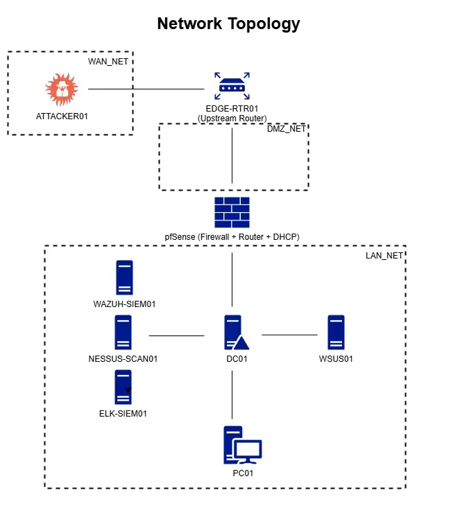
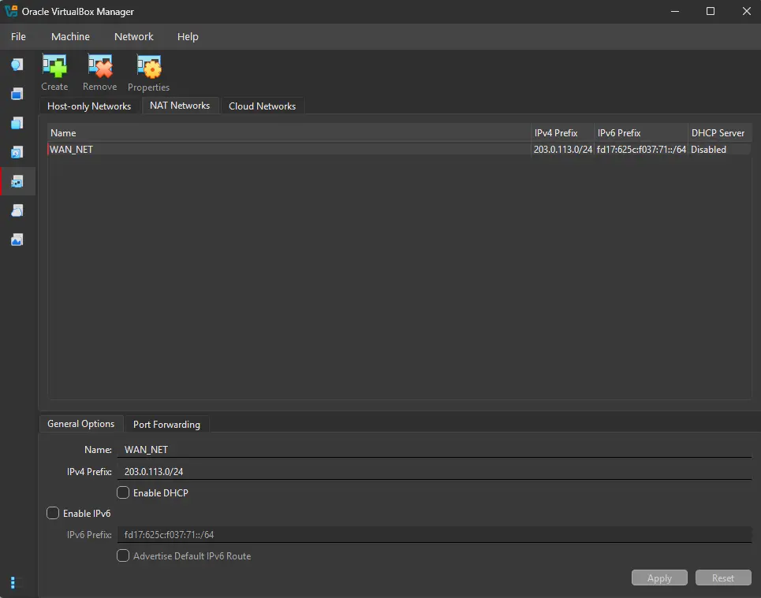
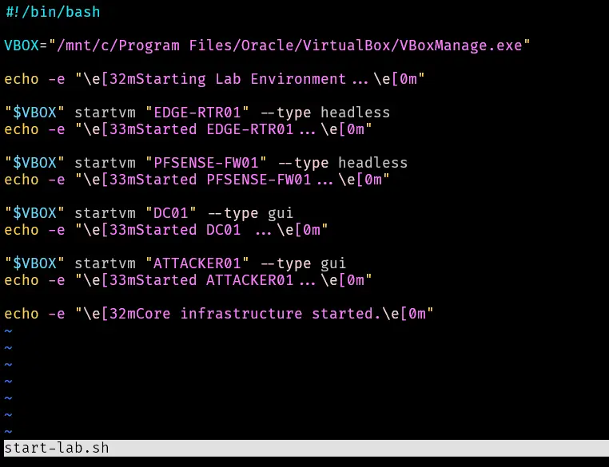
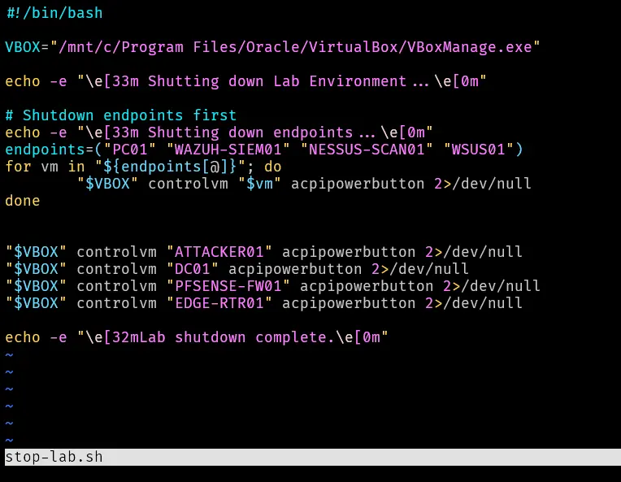

---
tags:
  - lab-documentation
  - overview
  - architecture
  - lab-infrastructure
type: reference
domain: lab.internal
network-segments:
  - WAN_NET: 203.0.113.0/24
  - DMZ_NET: 192.168.10.0/24
  - LAN_NET: 192.168.20.0/24
status: in-progress
---

# Cybersecurity Home Lab: Introduction

This project documents the design, implementation, and operation of a virtualized enterprise network environment. The lab simulates a small-scale corporate infrastructure, featuring a multi-zoned architecture (WAN, DMZ, and LAN) to facilitate hands-on practice with defensive security operations, network engineering, and attack simulation.

---

## Project Scope

The lab focuses on an on-premises enterprise network emulating a small organization. Key areas of focus include:
- **Network Segmentation:** Implementing a DMZ and internal trusted networks.
- **Defensive Capabilities:** Deploying SIEM and vulnerability management tools.
- **Incident Response:** Validating security controls through simulated attacks.

---

## Core Objectives
1.  **Network Segmentation:** Design and implement three distinct zones: **WAN**, **DMZ**, and **LAN**.
2.  **Firewall & Routing:** Deploy **pfSense** as the primary security gateway to enforce inter-zone policies.
3.  **Edge Services:** Utilize an upstream **Edge Router** for NAT and DNS resolution for the DMZ.
4.  **Identity Management:** Establish an **Active Directory (AD)** domain for centralized endpoint management.
5.  **Security Monitoring (Wazuh):** Deploy **Wazuh** for endpoint detection, alert generation, and correlation across the environment.
6.  **Security Monitoring (ELK):** Deploy an **ELK stack** (Elasticsearch, Logstash, Kibana) with **Beats** agents and **Sysmon** for log ingestion, enrichment, and visualization.
7.  **Vulnerability Management:** Use **Nessus** to identify and prioritize remediation of system misconfigurations.
8.  **Attack Simulation:** Execute external threat scenarios to validate detection and prevention controls.
9.  **Technical Documentation:** Maintain comprehensive records of lab architecture and findings.
---

## Lab Architecture & Design

### Network Topology


### Network Segment Rationale

| Segment     | Trust Level   | Description                                                                                                                                     |
| :---------- | :------------ | :---------------------------------------------------------------------------------------------------------------------------------------------- |
| **WAN_NET** | **Untrusted** | Simulates the public internet (TEST-NET-3, `203.0.113.0/24`). This is the origin point for all simulated external threats.                      |
| **DMZ_NET** | **Screened**  | Acts as a buffer between WAN and LAN (`192.168.10.0/24`). Hosts publicly accessible services. Requires two-boundary traversal to reach the LAN. |
| **LAN_NET** | **Trusted**   | The core internal zone (`192.168.20.0/24`). Protected by a default-deny policy on the pfSense firewall.                                         |

### Design Decisions
#### Wazuh
Wazuh's three central components - `wazuh-indexer`, `wazuh-manager` and `wazuh-dashboard` - are deployed on a single host `WAZUH-SIEM01` as an all-in-one installation.
This is appropriate for the scale of this environment; with fewer than 10 endpoints, log volume is well within the capacity of a single host.
In a larger enterprise environment, these components would typically run on dedicated servers to support horizontal scaling and high availability.

---

## Network Configuration

### VirtualBox Network Mapping
| Network Segment | VirtualBox Type | IP Address Space | Rationale |
| :--- | :--- | :--- | :--- |
| **WAN_NET** | NAT Network | `203.0.113.0/24` | Simulates public IP space; provides outbound access. |
| **DMZ_NET** | Internal Network | `192.168.10.0/24` | Isolated segment for DMZ services. |
| **LAN_NET** | Internal Network | `192.168.20.0/24` | Isolated segment for internal endpoints. |

> [!IMPORTANT]
> **WAN_NET and DMZ_NET use static addressing.** All IP addresses in these segments are assigned manually. Internal segments like **LAN_NET** utilize DHCP provided by **pfSense** for dynamic client configuration.



---

## Asset Inventory

| VM Name           | Role                         | OS                                          | vCPU | RAM   | Storage | NIC 1 (Network / IP)    | NIC 2 (Network / IP)   |
| :---------------- | :--------------------------- | :------------------------------------------ | :--- | :---- | :------ | :---------------------- | :--------------------- |
| **EDGE-RTR01**    | Edge Router                  | Ubuntu Server 25.10                         | 1    | 512MB | 10GB    | WAN: `203.0.113.3/24`   | DMZ: `192.168.10.3/24` |
| **PFSENSE-FW01**  | Firewall                     | pfSense                                     | 1    | 2GB   | 16GB    | DMZ: `192.168.10.1/24`  | LAN: `192.168.20.1/24` |
| **ATTACKER01**    | Threat Actor                 | Kali Linux                                  | 2    | 2GB   | 20GB    | WAN: `203.0.113.4/24`   | DMZ: `192.168.10.5/24` |
| **DC01**          | Domain Controller            | Windows Server 2019                         | 2    | 4GB   | 60GB    | LAN: `192.168.20.10/24` | -                      |
| **WAZUH-SIEM01**  | SIEM Server                  | Ubuntu Server 22.04.5                       | 4    | 8GB   | 50      | LAN: `192.168.20.20/24` | -                      |
| **ELK-SIEM01**    | Log Pipeline / Visualization | Ubuntu Server                               | TBD  | TBD   | TBD     | LAN: TBD                | -                      |
| **NESSUS-SCAN01** | Vuln Scanner                 | Tenable Core                                | TBD  | TBD   | TBD     | LAN: TBD                | -                      |
| **WSUS01**        | Update Server                | Windows Server                              | TBD  | TBD   | TBD     | LAN: TBD                | -                      |
| **PC01**          | Workstation                  | Windows 11, version 22H2 (22621.4108) amd64 | 2    | 4GB   | 64GB    | LAN: `DHCP`             | -                      |

### Domains

| Attribute              | Value          | Description                                              |
| ---------------------- | -------------- | -------------------------------------------------------- |
| **Forest Root Domain** | `lab.internal` | Primary DNS name of the forest                           |
| **NetBIOS Name**       | `LAB`          | Used for legacy compatibility and pre-windows 2000 login |

### IP Address Ranges

| Network Segment | IP Address Range                   | Description                                        |
| :-------------- | :--------------------------------- | :------------------------------------------------- |
| **LAN_NET**     | `192.168.20.1` - `192.168.20.99`   | Static IPs for devices requiring them (e.g. DC01)  |
| **LAN_NET**     | `192.168.20.100` - `192.168.20.199`| DHCP IP range                                      |

### Credentials
| VM Name          | Username                 | Password                           | Additional                    | Description               |
| :--------------- | :----------------------- | :--------------------------------- | ----------------------------- | ------------------------- |
| **EDGE-RTR01**   | `router-vm`              | `P@ssw0rd123`                      |                               | VM login                  |
| **PFSENSE-FW01** | `admin`                  | `P@ssw0rd123`                      |                               | Web interface login       |
| **ATTACKER01**   | `kali`                   | `kali`                             |                               | VM Login                  |
| **DC01**         | `Administrator`          | `P@ssw0rd123`                      | DSRM: `P@ssw0rd123`           | Local administrator login |
| **PC01**         | `jdoe@lab.internal`      | `P@ssw0rd123`                      |                               | Standard user login       |
| **DC01**         | `fvillalon@lab.internal` | `P@ssw0rd123`                      |                               | Domain Admin login        |
| **WAZUH-SIEM01** | `wazuh-siem01`           | `P@ssw0rd123`                      |                               | VM / SSH login            |
| **WAZUH-SIEM01** | `admin`                  | `6kN+Inwz2HU9GnTY*Fmt9DxshWLKTGbq` | `https://wazuh.lab.internal/` | Web interface login       |

---

## VirtualBox Additional Configuration & Scripts

### Bash Scripts
Two convenience scripts manage the lab infrastructure. Create the scripts directory and add it to `$PATH`:

```bash
mkdir -p ~/scripts
echo 'export PATH="$HOME/scripts:$PATH"' >> ~/.bashrc && source ~/.bashrc
```

#### `start-lab.sh`



#### `stop-lab.sh`



Make both scripts executable:

```bash
chmod +x ~/scripts/start-lab.sh
chmod +x ~/scripts/stop-lab.sh
```

The scripts can then be invoked directly from any terminal:

```bash
start-lab.sh
stop-lab.sh
```

---

## Future Roadmap

> [!NOTE]
> **Backlog & Enhancements**
> - [ ] Evaluate VyOS as an alternative edge router.
> - [ ] Implement RADIUS/NPS for pfSense authentication.
> - [ ] **Simulate Attack Scenarios:** CVE-2025-59287, CVE-2025-21418, CVE-2025-21376.
> - [ ] Deploy WSUS for lateral movement research (Update Injection).
> - [ ] Add AI enrichment to SIEM logs or maybe n8n pipeline
