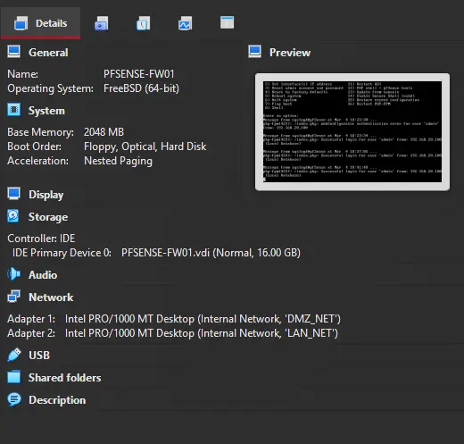
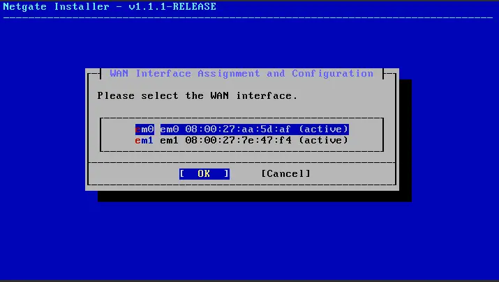
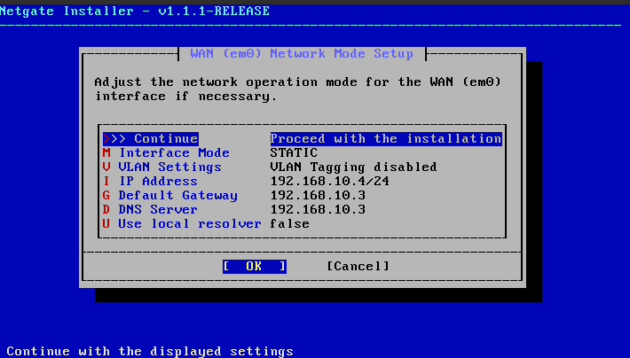
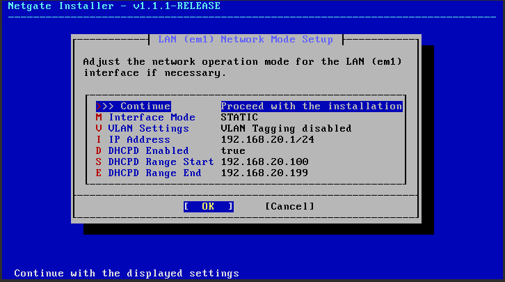
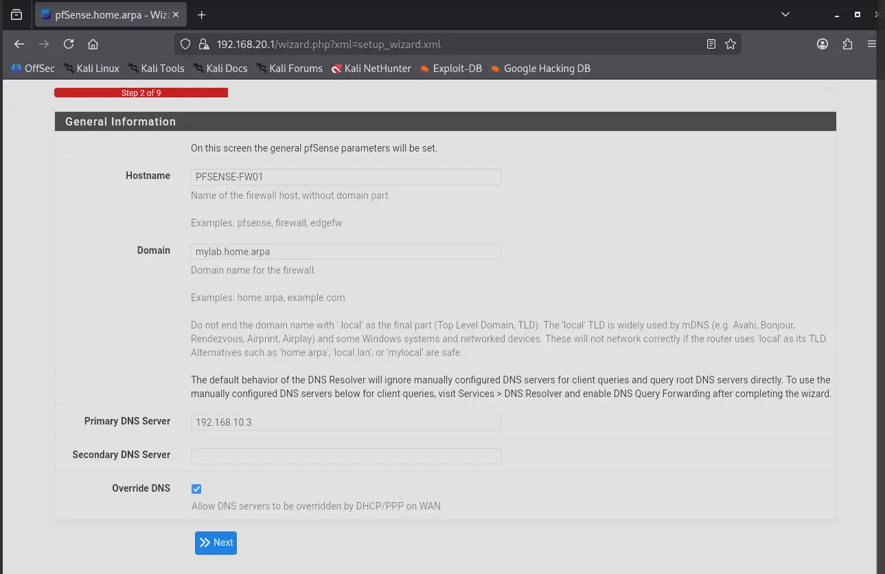
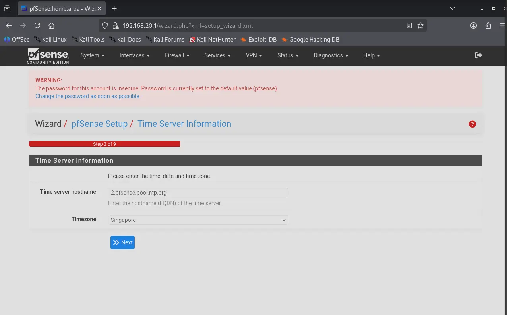
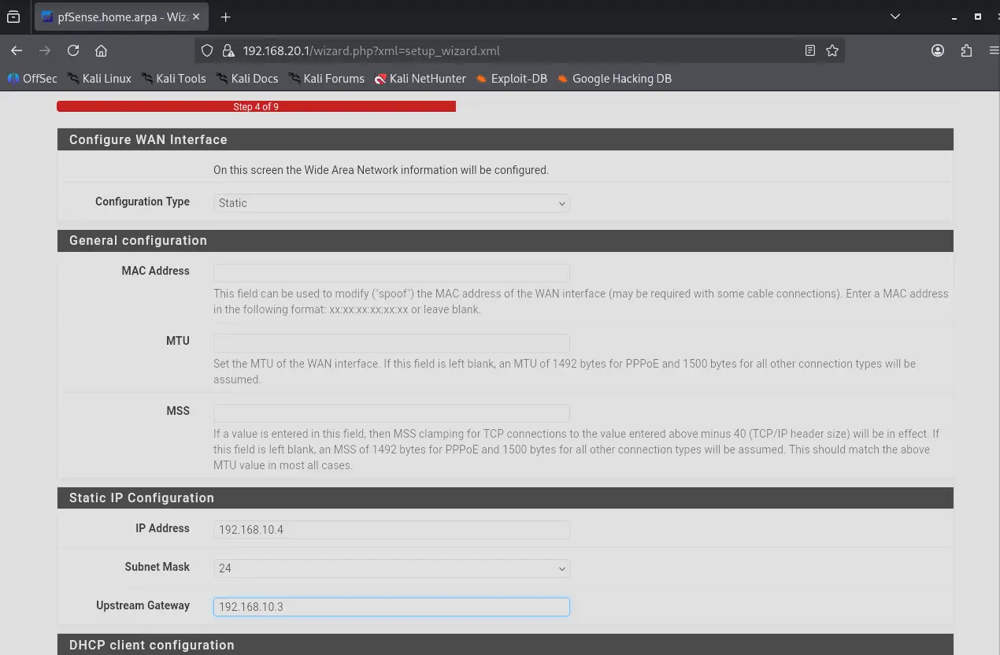
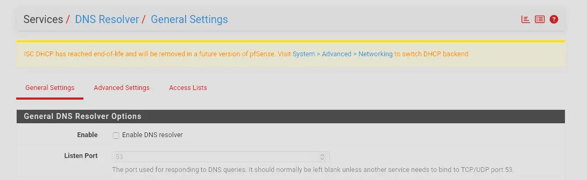
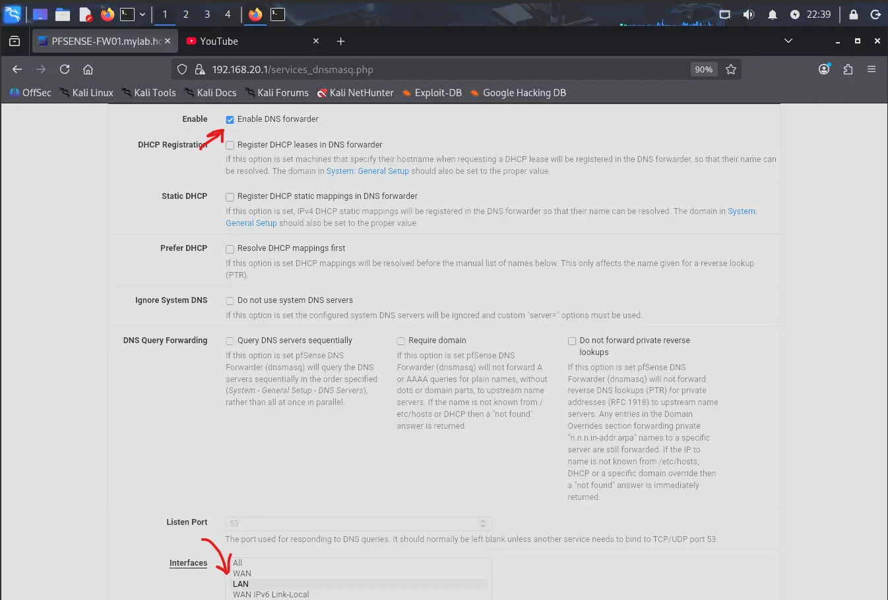

---
tags:
  - pfsense
  - firewall
  - lab-infrastructure
os: pfSense (FreeBSD)
role: Firewall / LAN DHCP Server
network:
  - DMZ_NET: 192.168.10.4/24
  - LAN_NET: 192.168.20.1/24
---

# PFSENSE-FW01

## VM Hardware Configuration

| Feature     | Configuration                |
| :---------- | :--------------------------- |
| **OS**      | pfSense (FreeBSD)            |
| **RAM**     | 2 GB                         |
| **CPU**     | 1 Core                       |
| **Storage** | 16 GB                        |
| **NIC 1**   | `DMZ_NET` (Internal Network) |
| **NIC 2**   | `LAN_NET` (Internal Network) |

---

## Installation

### 1. WAN Interface Assignment

The installation wizard prompts for WAN interface selection. Match the MAC address shown
in the wizard against the NIC intended for the WAN-facing segment. In this lab, `em0`
corresponds to the DMZ-facing NIC and is selected as WAN.

### 2. WAN Network Mode Configuration

The wizard then prompts for the WAN network operation mode. The default is DHCP, which
is not suitable here as EDGE-RTR01 does not provide DHCP services on DMZ_NET. Static
addressing is required.

| Setting             | Value             |
| :------------------ | :---------------- |
| **Interface Mode**  | Static            |
| **VLAN Tagging**    | Disabled          |
| **IP Address**      | `192.168.10.4/24` |
| **Default Gateway** | `192.168.10.3`    |
| **DNS Server**      | `192.168.10.3`    |

### 3. LAN Interface Assignment

The wizard prompts for LAN interface selection. Since PFSENSE-FW01 has only two NICs,
`em1` is the only remaining option and is automatically selected as LAN.

### 4. LAN Network Mode Configuration

| Setting               | Value             |
| :-------------------- | :---------------- |
| **Interface Mode**    | Static            |
| **VLAN Tagging**      | Disabled          |
| **IP Address**        | `192.168.20.1/24` |
| **DHCPD Enabled**     | Yes               |
| **DHCPD Range Start** | `192.168.20.100`  |
| **DHCPD Range End**   | `192.168.20.199`  |

> [!NOTE]
> The DHCP range begins at `192.168.20.100` to reserve `192.168.20.1–192.168.20.99`
> for statically assigned devices. Assets such as DC01 require a fixed IP address and
> must fall outside the dynamic range.

This concludes the pfSense installation wizard.

---

## Web-Based Setup Wizard

After the installation wizard, the web-based setup wizard must be completed at `https://192.168.20.1`.

Since DC01 has not yet been provisioned, ATTACKER01 is temporarily connected to `LAN_NET` to access the pfSense web UI. Configuring this connection follows the similar steps as establishing ATTACKER01's `WAN_NET` connection — refer to [ATTACKER01](ATTACKER01.md) for those steps and adjust them for `LAN_NET`.

> [!NOTE]
> The configuration below was completed prior to DC01 being provisioned. Fields such as the firewall domain name and NTP server hostname are left as placeholders and will be updated once Active Directory is established.

---

### Step 1 — Welcome & Support Registration

The wizard opens with a welcome screen followed by a Netgate support registration page. Both are skipped.

---

### Step 2 — General Information

| Setting                  | Value             |
| :----------------------- | :---------------- |
| **Hostname**             | `PFSENSE-FW01`    |
| **Domain**               | `mylab.home.arpa` |
| **Primary DNS Server**   | `192.168.10.3`    |
| **Secondary DNS Server** | —                 |

> [!NOTE]
> The domain is left as a placeholder and will be updated to `pfsense.lab.internal` once DC01 is
> provisioned. The Primary DNS Server is set to EDGE-RTR01 (`192.168.10.3`) as this field
> defines the DNS server used for pfSense's own operations — package updates, NTP lookups,
> etc. — not the DNS handed out to LAN clients. DC01 will be configured as the LAN client
> DNS server separately in the DHCP server settings.

---

### Step 3 — Time Server

The NTP hostname is left as default. The timezone is set to **Asia/Singapore**. DC01 will
be configured as the authoritative time source in a later phase.

---

### Step 4 — WAN Interface

The WAN interface settings are pre-populated from the installation wizard. Values are
reviewed and confirmed with no changes required.

---

### Step 5 — LAN Interface

The LAN interface settings are pre-populated from the installation wizard. Values are
reviewed and confirmed with no changes required.

---

### Step 6 — Admin Password

The admin password is set to `P@ssw0rd123`.

---

### Steps 7–9 — Reload & Complete

pfSense reloads to apply all configurations. The setup wizard is complete.

---

## Further Configuration After DC01

Now that DC01 is provisioned, all endpoints in LAN_NET must use DC01 as their DNS server. DNS queries that DC01 cannot resolve locally should be forwarded to pfSense, which then forwards them upstream to EDGE-RTR01.

This requires changes to pfSense's DNS and DHCP configuration.

### 1. Disable DNS Resolver

The DNS Resolver causes pfSense to act as a full recursive DNS server — it resolves everything itself, ignores the DHCP DNS setting, and assigns its own LAN IP (`192.168.20.1`) as the DNS server in every DHCP lease granted to endpoints. This must be disabled.

1. Navigate to the pfSense web interface at `https://192.168.20.1`
2. Go to **Services → DNS Resolver**
3. Uncheck **Enable DNS Resolver** → **Save**

---

### 2. Set DC01 as the DHCP DNS Server

With the DNS Resolver disabled, configure the DHCP server to hand out DC01's IP as the DNS server for all LAN clients.

1. Go to **Services → DHCP Server → LAN**
2. Under **DNS Servers**, set the first entry to `192.168.20.10`
3. **Save** and **Apply Changes**

---

### 3. Enable DNS Forwarder

The DNS Forwarder replaces the DNS Resolver as a lightweight pass-through service. Rather than resolving queries itself, it simply forwards them upstream to EDGE-RTR01. Notably, pfSense uses **dnsmasq** under the hood for this — the same tool configured on EDGE-RTR01.

1. Go to **Services → DNS Forwarder**
2. Check **Enable DNS Forwarder**
3. Under **Interfaces**, select **LAN** only — there is no reason to listen on the WAN interface
4. **Save**

---
### 4. Update Domain Name

Before adding PFSENSE-FW01 as a DNS forwarder, its domain name should be updated from the placeholder set during initial setup to a name consistent with the `lab.internal` namespace. This is also required for adding a reverse lookup PTR record for this device in DC01's DNS.

1. Navigate to the pfSense web interface at `https://192.168.20.1` , using a device connected to the `LAN_NET`. I am using `ATTACKER01` for now.
2. Go to **System → General Setup**
3. Change **Domain** from `mylab.home.arpa` to `pfsense.lab.internal`
4. **Save**

