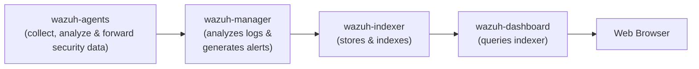
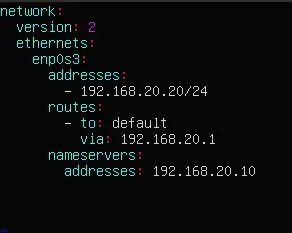
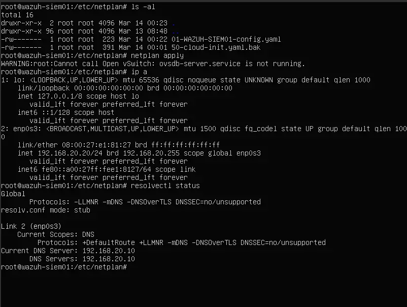
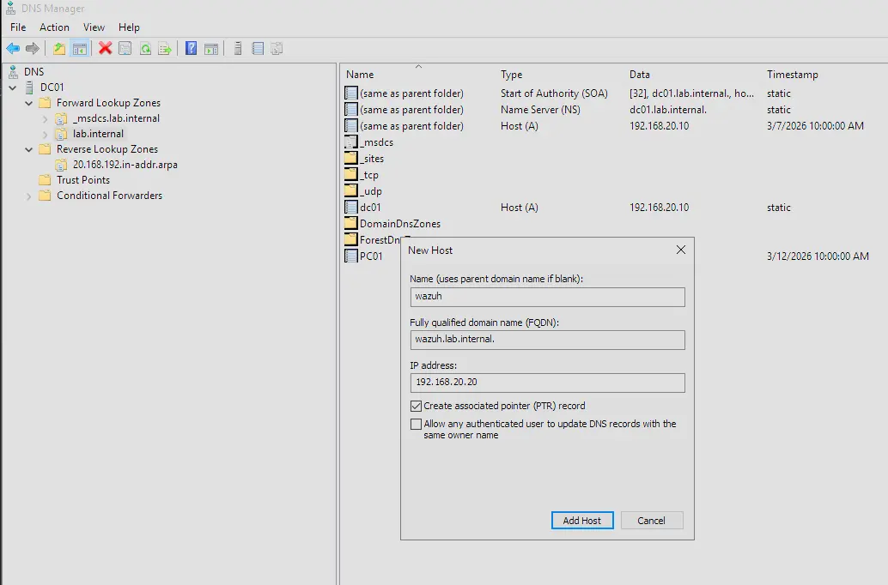
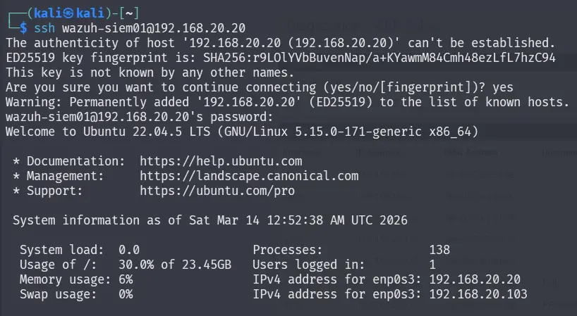
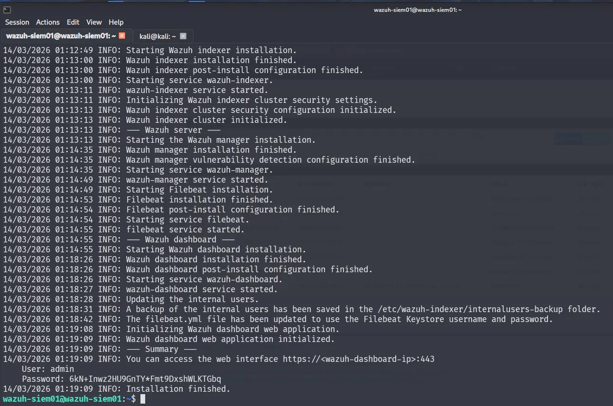
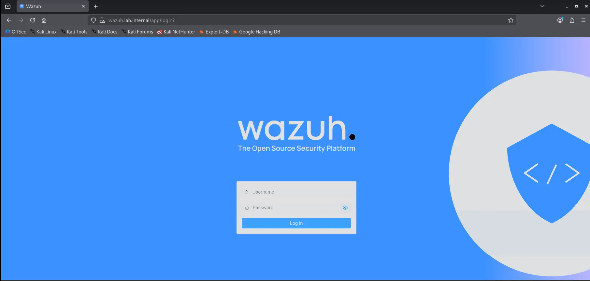
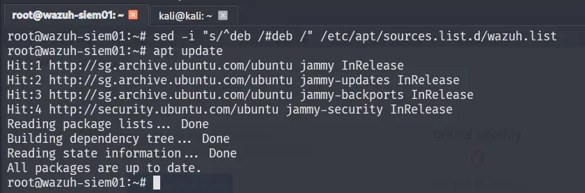
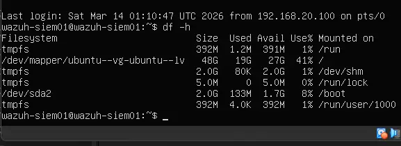

---
tags:
  - ubuntu-server
  - siem
  - wazuh
  - lab-infrastructure
os: Ubuntu Server 22.04.5
ip: 192.168.20.20
domain: lab.internal
role: SIEM Server
---

# WAZUH-SIEM01

WAZUH-SIEM01 is the primary security monitoring server for the lab. It runs the Wazuh all-in-one stack and collects alerts from agents deployed across the environment.

## Understanding Wazuh
Wazuh has three central components which are `wazuh-manager`, `wazuh-indexer`, `wazuh-dashboard`.
We can think of it as a **collect** -> **store** -> **visualize** pipeline.
### Wazuh-manager
The `wazuh-manager` or `wazuh-server` is the component of Wazuh that analyses the data received from the agents. It processes the data through decoders and rules. The server is also capable of looking well-known IoCs using threat intelligence and can scale horizontally when set up as a cluster.

### Wazuh-indexer
`wazuh-indexer` is a highly scalable, full-text search and analytics engine built on `OpenSearch`.

### Wazuh-dashboard
`wazuh-dashboard` is the web user interface for data visualization and analysis. It is also used to manage wazuh configurations and to monitor its status. It was built on `OpenSearch Dashboards`.

### Wazuh-agents
`wazuh-agents` are installed on endpoints and they provide threat prevention, detection, and response capabilities. 

### General Workflow


---

## VM Hardware Configuration

Wazuh documentation recommends the following specifications for environments with 1–25 agents.

### Specifications

| Feature     | Configuration                          |
| :---------- | :------------------------------------- |
| **OS**      | Ubuntu Server 22.04.5                  |
| **vCPU**    | 4                                      |
| **RAM**     | 8 GB                                   |
| **Disk**    | 50 GB                                  |
| **Network** | `LAN_NET` (Static IP: `192.168.20.20`) |

> [!IMPORTANT]
> In VirtualBox, the NIC must be attached to **LAN_NET**.

---

## OS Installation & Configuration

### 1. Installation & Initial Updates

During the Ubuntu Server installation, use the following credentials:

| Field        | Value          |
| :----------- | :------------- |
| **Username** | `wazuh-siem01` |
| **Password** | `P@ssw0rd123`  |

### 2. Network Configuration (Netplan)

Before doing anything else, set a static IP for this server. Similarly to EDGE-RTR01, this is done with Netplan.

```bash
# Need to be root
sudo su -

cd /etc/netplan

# Make sure this config is highest in the order
touch 01-WAZUH-SIEM01-config.yaml

# Manage permissions
chmod 600 01-WAZUH-SIEM01-config.yaml

# Apply netplan
netplan apply

# Verify
ip a
resolvectl status
```




**Configuration Summary:**

| Interface | Segment | IP Address         | Gateway        | DNS Server      |
| :-------- | :------ | :----------------- | :------------- | :-------------- |
| `enp0s3`  | LAN_NET | `192.168.20.20/24` | `192.168.20.1` | `192.168.20.10` |

---

## DNS Registration in DC01

### Adding the A Record and PTR

1. Open **DNS Manager** on DC01
2. Expand **DC01** → expand **Forward Lookup Zones** → right-click **`lab.internal`** → **New Host (A or AAAA)**
3. Set the following values and check **"Create associated pointer (PTR) record"**

| Field    | Value           |
| :------- | :-------------- |
| **Name** | `wazuh-siem01`  |
| **IP**   | `192.168.20.20` |




### Verifying the PTR Record

```bash
nslookup 192.168.20.20
# Expected: wazuh-siem01.lab.internal
```


---

## Wazuh Installation

SSH into WAZUH-SIEM01 from the Kali machine to manage it. This makes it easier to copy/paste commands from the Wazuh quickstart documentation.

```bash
ssh wazuh-siem01@192.168.20.20

# OR

ssh wazuh-siem01@wazuh-siem01.lab.internal
```



Follow the steps described here: [Quickstart · Wazuh documentation](https://documentation.wazuh.com/current/quickstart.html)

Once complete, access the dashboard using the credentials below:

| Field        | Value                                         |
| :----------- | :-------------------------------------------- |
| **Username** | `admin`                                       |
| **Password** | `6kN+Inwz2HU9GnTY*Fmt9DxshWLKTGbq`            |
| **URL**      | `https://wazuh-siem01.lab.internal/app/login` |





Additional, we are recommended to disable updates to wazuh that can break deployment.

```bash
sed -i "s/^deb /#deb /" /etc/apt/sources.list.d/wazuh.list
apt update
```



## Deploying Agents
Creating agents is done through the web interface `https://wazuh.lab.internal/` .


This runs you through the process of deploying an agent on an endpoint by creating a custom command line script that you can run.

### Agent for DC01


but

---
## Troubleshooting

### LVM Not Claiming Full Virtual Disk

Ubuntu's LVM may only claim a portion of the allocated virtual disk during installation (e.g. 24 GB out of 50 GB). The Wazuh all-in-one installer requires significant disk space — if the filesystem runs out mid-installation, `dpkg` will fail to extract packages and the installer will roll back everything.

Verify with:

```bash
df -h
```

Check that `/dev/mapper/ubuntu--vg-ubuntu--lv` size roughly matches the virtual disk size assigned in VirtualBox. If it doesn't, expand the logical volume and resize the filesystem:

```bash
lvextend -l +100%FREE /dev/mapper/ubuntu--vg-ubuntu--lv
resize2fs /dev/mapper/ubuntu--vg-ubuntu--lv
```



### Service Management
Wazuh services are managed by systemd and should auto-start on boot by default after quickstart installation. If for some reason the services do not start we can do the following
```bash
# Start all wazuh services
sudo systemctl start wazuh-manager wazuh-indexer wazuh-dashboard

# Check status
sudo systemctl status wazuh-manager
sudo systemctl status wazuh-indexer
sudo systemctl status wazuh-dashboard


# Enable auto-start on boot (if not already enabled)
sudo systemctl enable wazuh-manager wazuh-indexer wazuh-dashboard
```